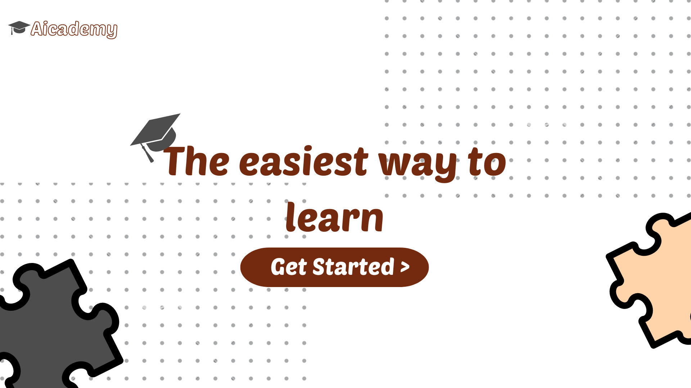

# Aicademy

Aicademy is your personal AI-powered learning application designed to make education more engaging, customized, and accessible. Whether you're a student, educator, or lifelong learner, Aicademy offers innovative tools to enhance your learning experience.

## Technologies and Dependecies  
| Feature                    | Framework / Tool                                         |
| -------------------------- | ------------------------------------------------------- |
| Frontend                   | [Reactjs](https://react.dev/)                              |
| Backend                    | [Java Spring Boot](https://spring.io/projects/spring-boot/), [Spring Security](https://spring.io/projects/spring-security) |
| Database & Storage         | [MongoDB](https://www.mongodb.com/docs/), [Firebase Storage](https://firebase.google.com/) (for Pdfs and images) |
| CSS Framework & Design Tools | Framework: [Tailwind CSS](https://tailwindcss.com/); Design tool: [Canva](https://www.canva.com/) |
| AI Models                  | Content: [Gemin-1.5-flash](https://console.cloud.google.com/vertex-ai/publishers/google/model-garden/gemini-1.5-flash-001?hl=it)  Image Generation: [DALL-E 3](https://platform.openai.com/docs/guides/images/introduction)  Image to Text: [Google Document AI](https://cloud.google.com/document-ai?hl=en) Quiz and Summary: Gpt-4o |
| Others                     | PDF Creation: [react-pdf](https://react-pdf.org/)    

## AI MODELS:
### Content Generation

**Tool:** Gemini 1.5-flash

**Description:** Used for generating personalized content.
### Image Notes to Text

**Tool:** Google Document AI

**Description:** Used for extracting text from images.
### Image Generation

**Tool:** Dall-e 3

**Description:** Used for creating images from textual descriptions.

### Quiz, Summary, Regenerate

**Tool:** gpt-4o

**Description:** Used for generating quizzes, summarizing text, and regenerating content.

## Key Features:

   ### Custom AI-Generated Lessons
   - Simply input the subject, topic name, and difficulty level, and Aicademy will create tailored lessons just for you. Our AI adapts to your needs, ensuring lessons are clear, accurate, and aligned with your learning goals.

   ### Dynamic MCQ Quizzes
   - Test your knowledge with AI-generated multiple-choice quizzes. You can base these on the lessons Aicademy creates or even upload your own PDFs. Whether you’re revising or exploring new content, Aicademy’s quizzes will keep you on track.

   ### Handwritten Notes to PDF Conversion
   - Snap a picture of your handwritten notes, and Aicademy will instantly convert them into neatly formatted PDF files, securely stored for easy access anytime, anywhere.

   ### AI-Generated Images
   - Visual aids are essential for effective learning. Aicademy can generate custom images related to your lessons, providing you with detailed visuals to deepen your understanding of the subject matter.

   ### Curated YouTube Video Links
   - Explore educational videos handpicked by Aicademy’s AI. It searches for relevant YouTube content, giving you quick access to expert explanations, tutorials, and demonstrations that complement your lessons.

   ### YouTube Video Summaries
   - Save time with Aicademy’s AI-driven video summaries. Simply provide a YouTube link, and get a concise overview of the video’s content, helping you quickly grasp key points.

   ### AI-Powered Chatbot
   - Engage in a personalized learning experience by chatting with Aicademy’s AI chatbot. Whether you need clarification on a lesson, help with a quiz, or general study advice, the AI chatbot is here to support you 24/7.
            

## Authors

- [@Nazmul Hossen ](https://github.com/NazmulRahul)
- [@Imran Bin Azad](https://github.com/Imran-2020331101)

